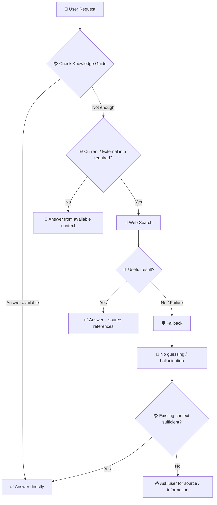

<div align="center">

# 🤖 AI Job Application Assistant
### 🔐 Tool Governance · Web Search · Controlled AI Behavior


<p>
  
  
  
  
</p>

### 🔗 Quick Access

[](https://chatgpt.com/g/g-6ab32eeab8c88191915986ea8efad18d-ai-job-application-assistant)
[](https://www.loom.com/share/cfd7f407d87b428d91c1bada246aa63b)

[](./test_examples.md)
[](./docs/implementation.md)
[](https://github.com/shaikshahid777/ai-job-application-assistant-tool-governance)

<p>
  <a href="./test_examples.md"></a>
  <a href="https://github.com/shaikshahid777/ai-job-application-assistant-tool-governance"></a>
</p>

</div>

---

## ✨ What This Project Demonstrates

This repository documents **Topic 6 — Tool Usage & Capabilities: Tool Governance** for the **AI Job Application Assistant** Custom GPT.

The implementation enables **Web Search** while enforcing a controlled decision process:

> **Use the tool when it is necessary. Skip it when it is unnecessary. Never hallucinate when it fails.**

The result is a more predictable and explainable tool-using GPT.

---

## 🎯 Assessment Objectives

| Capability | Implementation |
|---|---|
| 🔌 Tool enabled | **Web Search** |
| 🟢 Trigger conditions | Current / live / external information |
| 🔴 Non-trigger conditions | Knowledge Guide, conversation, resume, JD, simple writing |
| 🛡️ Fallback behavior | Transparent failure handling + no guessing |
| 🧪 Validation | 3 practical scenarios |
| 📋 Evidence | `test_examples.md` |
| 🎥 Demonstration | Loom video |

---

## 🧠 Governance Logic



---

## 🔐 Tool Governance Rules

### 🟢 1. Trigger — When Web Search SHOULD run

Web Search is used when the request requires **current, live, external, or online information**.

Examples:

- User explicitly asks to search the web.
- Current company information.
- Current job opportunities.
- Current job-market information.
- Time-sensitive information.
- External job postings or webpages requiring web access.
- Current external research for an uncovered question.

### 🔴 2. Non-Trigger — When Web Search SHOULD NOT run

Web Search is skipped when:

- The answer is already in the Knowledge Guide.
- The answer is already available in the conversation.
- The user's resume or job description is sufficient.
- The user asks about documented workflow or definitions.
- The task is simple writing, rewriting, formatting, or explanation.
- Current or external information is not required.

**Principle:** Web Search is not used simply because it is enabled.

### 🛡️ 3. Fallback — When the tool fails

If Web Search fails, is unavailable, or returns no useful result:

1. Explain the limitation clearly.
2. Never guess or invent information.
3. Use existing Knowledge Guide/conversation context when sufficient.
4. Ask the user for the required source or information when necessary.
5. Never claim that a search was completed when it was not.

---

## 🧪 Validation Results

### Test 01 · Tool Required

**Prompt:**  
Search the web and find the current official careers page and latest publicly available information about OpenAI's current job opportunities.

**Expected:** Web Search triggers.

**Observed:** Web Search triggered and returned current external information with sources.

**Result:** 🟢 **PASS**

---

### Test 02 · Tool Not Required

**Prompt:**  
According to the Knowledge Guide, what are the three skill-match classifications?

**Expected:** Web Search is skipped.

**Observed:** GPT answered from the Knowledge Guide:

> **Match · Partial Match · Missing**

No external research was required.

**Result:** 🟢 **PASS**

---

### Test 03 · Fallback

**Prompt:**  
If Web Search fails, returns no useful results, or is unavailable, what should you do?

**Expected:** Transparent failure handling without hallucination.

**Observed:** GPT correctly described the fallback behavior and prohibited guessing or falsely claiming that a search was completed.

**Result:** 🟢 **PASS**

---

## 📊 Final Validation Matrix

| Requirement | Status |
|---|:---:|
| Web Search enabled | 🟢 PASS |
| Trigger rules defined | 🟢 PASS |
| Non-trigger rules defined | 🟢 PASS |
| Fallback behavior defined | 🟢 PASS |
| Tool-required scenario | 🟢 PASS |
| Non-tool-required scenario | 🟢 PASS |
| Fallback scenario | 🟢 PASS |

### 🏆 Final Evidence: **7/7 PASS**

Full evidence is available in **[test_examples.md](./test_examples.md)**.

---

## 🗂️ Repository Structure

```text
ai-job-application-assistant-tool-governance/
│
├── 📄 README.md
├── 🧪 test_examples.md
└── 📁 docs/
    └── implementation.md
```

---

## 🔗 Project Links

| Resource | Link |
|---|---|
| 🤖 Custom GPT | [AI Job Application Assistant](https://chatgpt.com/g/g-6ab32eeab8c88191915986ea8efad18d-ai-job-application-assistant) |
| 🎥 Loom Demo | [Watch Demonstration](https://www.loom.com/share/cfd7f407d87b428d91c1bada246aa63b) |
| 🧪 Test Evidence | [Open test_examples.md](./test_examples.md) |
| 📦 Repository | [GitHub Repository](https://github.com/shaikshahid777/ai-job-application-assistant-tool-governance) |

---

## 🧩 Design Principles

### 📚 Source Priority
The Knowledge Guide remains the primary source for the assistant's documented processes, rules, and definitions.

### 🎯 Least-Necessary Tool Use
The GPT does not call Web Search merely because the capability exists.

### 🛡️ Truthfulness
The GPT must not fabricate user information, job requirements, tool results, metrics, or sources.

### 🔎 Evidence-Based Search
When Web Search is appropriate, current factual claims are based on retrieved external sources.

### 🚨 Graceful Failure
Tool failure is handled transparently rather than converted into a guessed answer.

---

## 📌 Scope & Assumptions

This repository documents the Topic 6 assessment implementation.

- The **Knowledge Guide** is authoritative for documented assistant workflows and definitions.
- The **user's resume** is authoritative for personal/application background.
- The **user-provided job description** is authoritative for job-specific requirements.
- **Web Search** is an external-information capability and does not replace the Knowledge Guide.
- Tool availability or web results may vary over time.

---

## 👨‍💻 Author

**Shaik Mohammad Shaheed**

AI & Automation · Generative AI · Prompt Engineering · n8n · AI Agents

---

<div align="center">

### 🚀 Topic 6 · Tool Governance

**Trigger when necessary · Skip when unnecessary · Fail safely**


</div>
